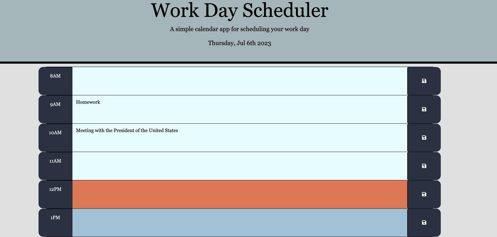

# work-day-scheduler
Module 05 Third-Party APIs

## Information
User Story of this project: 
To create a webpage that lets someone with a busy schedule add important events to a daily planner during business hours.

## Description
This webpage allows users to add events to a planner with hourly time blocks during normal business hours. The time blocks will change colors to refelct the time of day. The current time block will be highlighted orange. To add an event/task, simply click onto the empty row in the time block and type in a description of the task/event. The user must then click the save button present to the right at which point the webpage will save it. The information will remain on the page even with a reload. To delete, the user may manually delete the description in the block or simply save another instead. 

## Usage 
No downloads are necessitated to utilize this workday scheduler. This is a deployed webpage application that may be used via any Web browser. 

## Links
You may access the deployed application at: 
https://shaffachaudhry.github.io/work-day-scheduler/

you may access the repository at: 
https://github.com/shaffachaudhry/work-day-scheduler

## Sources Utilized 
Multiple sources were used to help in the functionality of the website to include 
-Class Activities Module 5 Third Party API's
-https://momentjs.com/guides/
-https://developer.mozilla.org/en-US/docs/Web/API/Window/localStorage
-https://www.w3schools.com/jquery/html_removeclass.asp#:~:text=The%20removeClass()%20method%20removes,names%20from%20the%20selected%20elements.

## Mock Image
